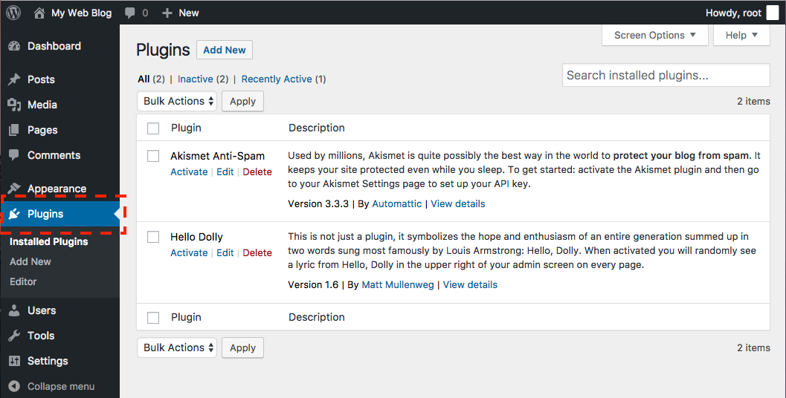
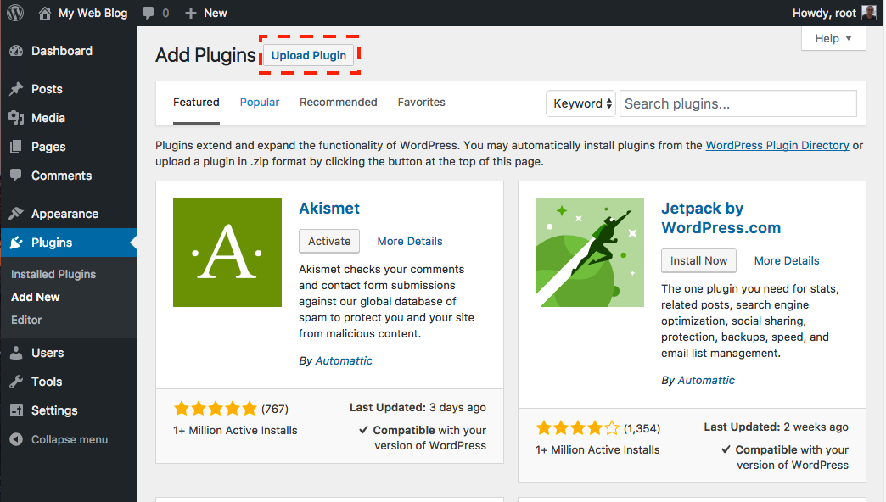
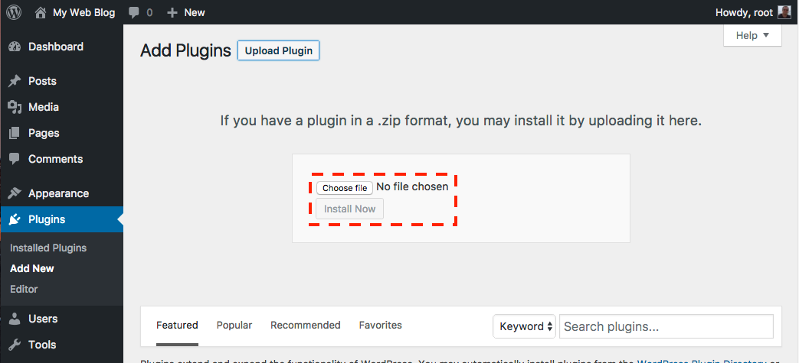
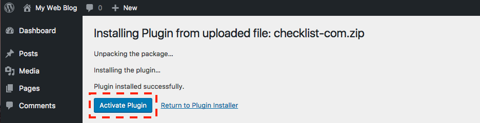
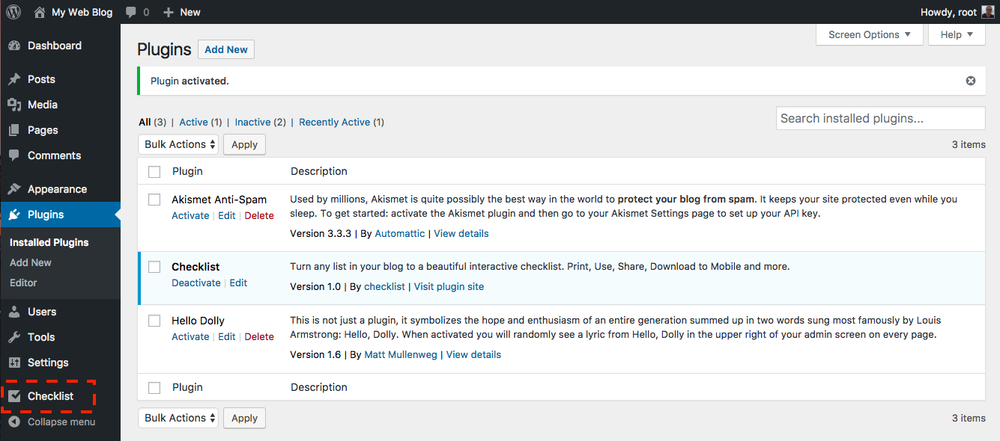

# wordpress

This is the Github repository for the official Checklist Wordpress plugin.

Please feel free to ask questions, make suggestions or even commit code. 

You can install the Checklist Wordpress Plugin here:

https://wordpress.org/plugins/checklist

The Checklisters

## Installation instructions:

Download the latest Plugin version from : xxxx . Do NOT unzip the file.

Click on the Plugins menu on left side of your Admin:

Click on Upload Plugin at the top of the screen:

Click on the "Choose file" button and select the plugin zip file you have previously downloaded:

Click on Install now and wait for the plugin to upload and install. Once ready, click on the Activate Plugin button:

You can update the plugin settings from the Checklist menu on the left:

You can now follow the instructions manual here:

[Checklist Plugin User Guide](guide.md)

